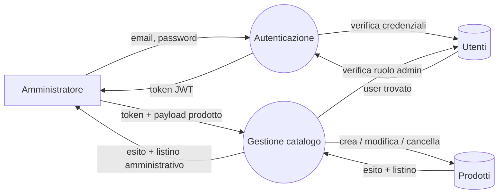
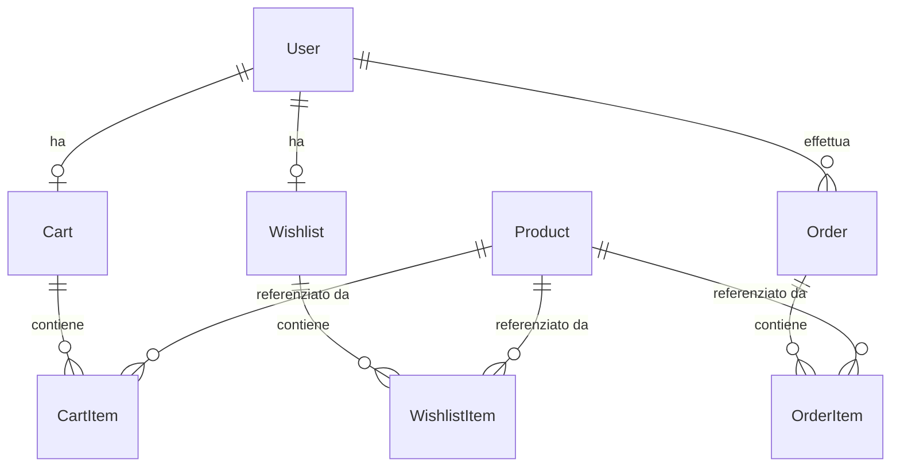

# Specifiche del progetto

Documento che accompagna il [README](README.md) e descrive *cosa* fa Shop
Online (e cosa intenzionalmente non fa), per chi è pensato, e quali sono
i vincoli che hanno guidato le scelte progettuali. Il README, invece,
spiega *come* installare, avviare e usare l'applicazione.

## Cos'è Shop Online

Un'applicazione web full-stack di e-commerce: un esercente espone online
il proprio catalogo di prodotti e i clienti li acquistano attraverso il
classico flusso carrello → checkout → ordine. L'applicazione gestisce
internamente autenticazione, persistenza dei carrelli e degli ordini, e
un pannello amministrativo per la gestione del catalogo.

Nasce come applicazione didattica costruita per l'esame di Ingegneria del Software Avanzata (e in precedenza Progetto di Sistemi Web) del Corso di Laurea Magistrale in Ingegneria Informatica e dell'Automazione.

## Utenti del sistema

Tre profili distinti:

- **Visitatore** — utente non autenticato. Può consultare il catalogo
  pubblico ma non può aggiungere prodotti al carrello, gestire una
  wishlist o completare ordini.
- **Cliente** (`customer`) — utente registrato. Ruolo predefinito alla
  registrazione. Gestisce il proprio carrello, la propria wishlist e
  completa ordini.
- **Amministratore** (`admin`) — utente con privilegi estesi. Oltre alle
  funzioni del cliente, può creare, modificare ed eliminare prodotti dal
  catalogo. Il ruolo `admin` non è assegnabile via API pubblica.

## Cosa fa il sistema

### Catalogo

Mostra l'elenco dei prodotti, accessibile anche senza login. Supporta
ricerca testuale per titolo, filtri per intervallo di prezzo, e
ordinamento per prezzo o data di inserimento. Ogni prodotto ha titolo,
descrizione, prezzo corrente, prezzo originale, flag "in saldo",
thumbnail, lista di tag e quantità in stock.

### Autenticazione

Login con email e password. Le password sono memorizzate solo come
digest BCrypt, mai in chiaro. Al login l'utente riceve un token JWT
firmato (HS256, scadenza 24 ore) che presenta nelle richieste successive
nell'header `Authorization: Bearer ...`. Le email sono normalizzate
(trim + lowercase) sia in registrazione che in login, così
`"  Mario@Example.COM "` e `mario@example.com` sono la stessa identità.

### Carrello

Ogni cliente ha un carrello persistente lato server, creato al volo alla
prima richiesta. Aggiungere un prodotto al carrello **congela il prezzo
unitario corrente** nella voce creata: variazioni di listino successive
non alterano le voci già aggiunte. Aggiungere lo stesso prodotto due
volte somma le quantità in una sola voce invece di crearne una seconda.
Il sistema rifiuta sempre quantità superiori allo stock disponibile.

### Wishlist

Ogni cliente ha una wishlist persistente. L'aggiunta è **idempotente**:
aggiungere due volte lo stesso prodotto non duplica la voce e
restituisce semplicemente `200` invece di `201`. La wishlist è
indipendente dal carrello — non c'è una funzione automatica "sposta
nella wishlist al carrello".

### Checkout e ordini

Il cliente conferma l'acquisto fornendo dati di spedizione (nome,
indirizzo, CAP). La creazione dell'ordine è **transazionale**: in
un'unica transazione il sistema verifica lo stock di tutti i prodotti
coinvolti, crea l'ordine e le sue voci, decrementa lo stock e svuota il
carrello. Se anche un solo passaggio fallisce, nessun effetto è
persistito — non si verifica mai uno stato intermedio in cui lo stock è
stato decrementato senza che l'ordine sia stato creato (o viceversa).

Anche per le voci d'ordine il prezzo unitario viene congelato al
momento della creazione dell'ordine, in modo che lo storico resti
fedele a ciò che il cliente ha visto al momento dell'acquisto.

Una volta creato, l'ordine è **immutabile**: per semplicità di
sviluppo non è previsto un ciclo di vita (conferma, spedizione,
consegna, annullamento). L'ordine esiste come "fotografia" dell'acquisto
fatto, con dati di contatto, indirizzo di spedizione, totale e voci
acquistate al prezzo congelato del momento. Non c'è uno stato e non
sono previste transizioni gestite dall'esercente.

Il cliente può consultare lo storico dei propri ordini, filtrato per
intervallo di date e di importo.

### Pannello amministrativo

L'admin accede a un'area dedicata per gestire il catalogo: lista,
creazione, modifica e cancellazione dei prodotti. Cancellare un prodotto
rimuove in cascata anche le voci di carrello, wishlist e ordine che lo
referenziano. Le richieste agli endpoint amministrativi provenienti da
utenti non admin ricevono risposta `403`.

## Qualità attese

Il sistema deve garantire:

- **Sicurezza di base**: password mai in chiaro, autorizzazione esplicita
  su ogni operazione di scrittura, isolamento dei dati per utente (un
  cliente non vede né modifica risorse di altri clienti — la risposta
  in caso di violazione è `404`, non `403`, per non rivelare l'esistenza
  delle risorse altrui).
- **Coerenza storica**: i prezzi memorizzati nelle voci di carrello e
  d'ordine non cambiano quando il prezzo del prodotto cambia.
- **Atomicità del checkout**: stock, ordine e carrello restano sempre
  coerenti, anche in caso di errore.
- **Riproducibilità del build**: dipendenze pinnate nei file di lock
  versionati (`Gemfile.lock`, `package-lock.json`); immagini Docker
  buildabili dai `Dockerfile` versionati.

## Vincoli tecnologici e di processo

- **Backend**: Ruby on Rails 8 in modalità API, database SQLite.
- **Frontend**: Angular 21 con TypeScript e Angular Material.
- **Comunicazione client/server**: HTTP/JSON (REST). No WebSocket, no gRPC.
- **Autenticazione**: JWT firmati HS256, nessuna sessione lato server.
- **Distribuzione**: container Docker buildati dai Dockerfile versionati,
  pubblicati su GitHub Container Registry al push di un tag SemVer.
- **Sviluppo**: ogni modifica passa da Pull Request con pipeline CI
  verde prima del merge in `main`; commit nello stile Conventional
  Commits.

## Flusso di amministrazione (DFD)

Per dare un'immagine compatta del comportamento del sistema, uso un
Data Flow Diagram del flusso di amministrazione: il percorso che
l'admin compie dalla login alla gestione del catalogo prodotti.

**Notazione** (convenzione classica dei DFD):

- I **cerchi** sono le **funzioni** del sistema.
- I **cilindri** sono gli **archivi persistenti** (le tabelle del DB).
- I **rettangoli** sono gli **agenti esterni**.
- Le **frecce etichettate** sono i **flussi di dati**: dicono *cosa*
  viaggia da un nodo all'altro, non quando o in che ordine.

**Come si legge**: dopo aver ottenuto il token, ogni richiesta dell'admin
entra in `Gestione catalogo`, che prima rilegge `Utenti` per verificare
il ruolo (un token valido ma di un utente `customer` non basta — viene
rifiutato con `403`) e solo poi agisce su `Prodotti`. L'arco
`Gestione → Utenti` rende esplicito il controllo di autorizzazione che
nella prosa è descritto a parole.

Il diagramma non descrive sincronizzazione, ordine delle operazioni o
gestione degli errori: rappresenta la **struttura del flusso
informativo**, non quella del controllo.

## Modello dei dati

Sei entità persistenti collegate come segue:

- **User** — identità (email univoca, password digest, ruolo).
- **Product** — articolo del catalogo. Identificatore stringa stabile
  (slug derivato dal titolo) e non auto-incrementale, per mantenere URL
  pubblici stabili anche dopo reimport.
- **Cart / CartItem** — carrello attivo del cliente e le sue voci. Una
  voce è univoca per coppia `(cart, product)`.
- **Wishlist / WishlistItem** — equivalente per la wishlist. Una voce è
  univoca per coppia `(wishlist, product)`.
- **Order / OrderItem** — ordine confermato e le sue voci. Il prezzo
  unitario è quello vigente al momento dell'ordine e non viene mai
  aggiornato successivamente.

